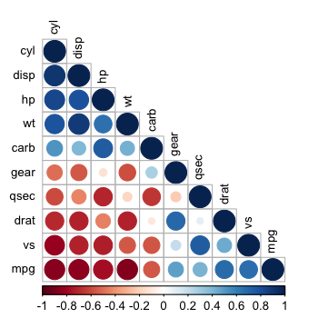

## Investigation of pca on regression model

In the project, I will do

1. Data exploratory 

2. Linear regression model fitting

3. Making prediction on difference between automatice and manual 

of the `mtcar` data in R

--- .class #id 

## Data exploratory

A `?mtcars` can be used to investigate the data. 


```r
summary(mtcars)
```

```
      mpg             cyl             disp             hp             drat             wt       
 Min.   :10.40   Min.   :4.000   Min.   : 71.1   Min.   : 52.0   Min.   :2.760   Min.   :1.513  
 1st Qu.:15.43   1st Qu.:4.000   1st Qu.:120.8   1st Qu.: 96.5   1st Qu.:3.080   1st Qu.:2.581  
 Median :19.20   Median :6.000   Median :196.3   Median :123.0   Median :3.695   Median :3.325  
 Mean   :20.09   Mean   :6.188   Mean   :230.7   Mean   :146.7   Mean   :3.597   Mean   :3.217  
 3rd Qu.:22.80   3rd Qu.:8.000   3rd Qu.:326.0   3rd Qu.:180.0   3rd Qu.:3.920   3rd Qu.:3.610  
 Max.   :33.90   Max.   :8.000   Max.   :472.0   Max.   :335.0   Max.   :4.930   Max.   :5.424  
      qsec             vs               am              gear            carb      
 Min.   :14.50   Min.   :0.0000   Min.   :0.0000   Min.   :3.000   Min.   :1.000  
 1st Qu.:16.89   1st Qu.:0.0000   1st Qu.:0.0000   1st Qu.:3.000   1st Qu.:2.000  
 Median :17.71   Median :0.0000   Median :0.0000   Median :4.000   Median :2.000  
 Mean   :17.85   Mean   :0.4375   Mean   :0.4062   Mean   :3.688   Mean   :2.812  
 3rd Qu.:18.90   3rd Qu.:1.0000   3rd Qu.:1.0000   3rd Qu.:4.000   3rd Qu.:4.000  
 Max.   :22.90   Max.   :1.0000   Max.   :1.0000   Max.   :5.000   Max.   :8.000  
```

---

## Data exploratory (cont'd Correlation plot)


```r
library(corrplot)
correlMatrix <- cor(mtcars[, -9]) # eliminate the 
corrplot(correlMatrix, order = "FPC", method = "circle", type = "lower", 
         tl.cex = 0.8,  tl.col = rgb(0, 0, 0))
```

<div class="rimage center"></div>

---

## Linear model

Build linear model with the same linear regession with or without "pca"


```r
library(caret)
set.seed(1234)
inTrain <- createDataPartition(y = mtcars$am, p = 0.7, list = FALSE)
train <- mtcars[inTrain, ]
test <- mtcars[-inTrain, ]
model1 <- train(factor(am) ~., method = "glm", data = train) #glm method
model2 <- train(factor(am) ~., method = "glm", preProcess = "pca", data = train) #glm method with pca
prediction1 <- predict(model1,test)
prediction2 <- predict(model2,test)
```

---

## Accurarcy

We can see the linear regression with "pca" as pre-process has much better accuracy: 1!


```r
confusionMatrix(test$am, prediction1)$overall[1]
```

```
 Accuracy 
0.8888889 
```

```r
confusionMatrix(test$am, prediction2)$overall[1]
```

```
Accuracy 
       1 
```


